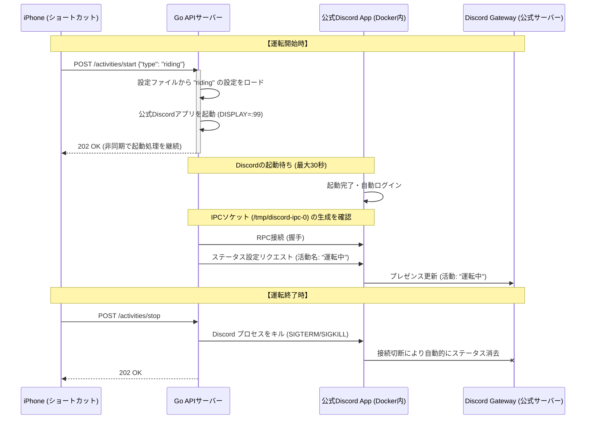

# 詳細仕様書 (spec.md)

本仕様書は、Proxmox上のDockerコンテナにおいて、軽量かつ規約に準拠した形でユーザーのDiscordステータス（「○○をプレイ中」）を更新・制御するシステムの詳細な技術仕様を定義します。

---

## 1. システム構成と動作フロー

### 1.1 動作フロー
本システムは、運転中のみDiscordのデスクトップクライアントを仮想環境で起動し、運転終了時に終了する「オンデマンド起動方式」を採用します。



---

## 2. API設計

APIサーバーはポート `8080` (デフォルト) で待受を行います。

### 2.1 エンドポイント
#### ① `POST /activities/start`
* **概要**: 指定されたアクティビティを開始する（Discordを起動しステータスを設定する）。
* **リクエストボディ**:
  ```json
  {
    "type": "riding"
  }
  ```
* **処理**:
  1. `config.json` から `type` に一致する設定を取得（見つからない場合は `400 Bad Request`）。
  2. すでにDiscordが起動している場合は、Discordの再起動は行わず、RPC経由でステータスのみを新しいものに更新する。
  3. 起動していない場合は、`Xvfb` と `discord` アプリを起動し、起動完了後にRPC接続してステータスを設定する。
* **レスポンス**: `202 Accepted`
  ```json
  {
    "status": "starting",
    "message": "Activity startup sequence initiated for: riding"
  }
  ```

#### ② `POST /activities/stop`
* **概要**: 現在起動しているアクティビティを停止する（Discordプロセスを終了する）。
* **リクエストボディ**: なし（または空のJSON）
* **処理**:
  1. `discord` および `Xvfb` のプロセスをキルする。
  2. プロセスが正常にキルされたことを確認する。
* **レスポンス**: `202 Accepted`
  ```json
  {
    "status": "stopping",
    "message": "Activity stop sequence initiated"
  }
  ```

#### ③ `GET /status`
* **概要**: 現在のサーバーの状態を取得する。
* **レスポンス**: `200 OK`
  ```json
  {
    "discord_running": true,
    "current_activity": "riding",
    "memory_usage_bytes": 314572800
  }
  ```

---

## 3. 設定ファイルの設計 (`config.json`)

拡張性を担保するため、アクティビティの設定は以下の形式で外部ファイル化します。

```json
{
  "activities": {
    "riding": {
      "name": "運転中",
      "details": "バイクを運転しています",
      "state": "インカム接続中 🏍️",
      "client_id": "123456789012345678" 
    },
    "working": {
      "name": "仕事中",
      "details": "コーディングに集中しています",
      "state": "連絡は遅れます 💻",
      "client_id": "876543210987654321"
    }
  }
}
```
* **`client_id`**: Discord Developer Portalで作成した「アプリケーションID」です。表示させたいアクティビティ名（「運転中」など）を名前としたアプリケーションを作成し、そのIDを設定します。これにより、ステータスに「**[アプリケーション名] をプレイ中**」と表示されます。

---

## 4. Docker環境の設計

### 4.1 ベースイメージ
* `debian:bookworm-slim` を使用。
* 必要な依存パッケージ群（GUIライブラリ、仮想フレームバッファ、VNC）をインストール。

### 4.2 ディレクトリ構成（コンテナ内）
* `/app/bin/server`: GoのAPIサーバーバイナリ
* `/app/config.json`: アクティビティ設定ファイル
* `/root/.config/discord`: Discordのログインセッション保存ディレクトリ（ホスト側とマウント）
* `/tmp`: DiscordのIPCソケット（`discord-ipc-0`）が生成される共有ディレクトリ

### 4.3 VNC接続（初回ログイン用）
* 初回起動時やログイン切れの際、コンテナ内で動いているDiscordに手動ログインするため、`x11vnc` をポート `5900` で待ち受けさせます。
* ログインが成功した後は、セキュリティのためにコンテナの環境変数（例: `ENABLE_VNC=false`）でVNC機能を無効化できるようにします。

---

## 5. 将来の拡張性（AI代理返答など）

本システムは、将来的に「他のAIエージェントがDiscordを通じて自動で代理返答する」などの拡張を安全に行えるよう、**依存性注入（DI）**と**インターフェースによる抽象化**を取り入れた設計になっています。

### 5.1 DiscordController インターフェース
APIサーバー（`main.go`）と、Discordの実装（`service.go`）は、`DiscordController` インターフェースを通じて疎結合に連携します。

```go
type DiscordController interface {
    StartActivity(act Activity, typeName string) error
    StopActivity() error
    IsRunning() bool
    IsStarting() bool
    GetCurrentActivity() string
    
    // --- 将来的な拡張用のプレースホルダー ---
    SendMessage(channelID string, content string) error
    // OnMessageReceived(handler func(msg DiscordMessage))
}
```

### 5.2 拡張シナリオ
1. **AIエージェントによるメッセージ送信（代理返答）**:
   * 現在の `HeadlessDiscordController` に `SendMessage` メソッドの実装（DiscordのユーザーAPIを叩く機能）を追加することで、サーバー側からDiscordチャネルへの発言が容易に可能になります。
2. **別アプローチ（Direct API）への移行**:
   * もし「ヘッドレス起動」をやめ、直接Discord API（Gateway WebSocket）を常駐させる方式に切り替える場合でも、新しく `DirectAPIController` を作成してインターフェースを実装すれば、**HTTPハンドラーや設定ファイルのコードを一切変更することなく、裏側の仕組みだけを丸ごと差し替えることができます。**
3. **メッセージ監視（リスナー）の追加**:
   * メッセージの受信イベントをフックしてAIエージェントの処理（返信内容の生成など）に中継する機能も、このコントローラーのライフサイクルにリスナーを登録するだけでクリーンに実装できます。

